# Começando as aventuras

Primeiro desafio da CTF de 2019!

Espero ajudar iniciantes com este projeto, lembrando que estes repositórios são um complemento explicativo aos vídeos disponíveis em meu canal, Divirtam-se :) !

# Arquivos

Os arquivos coletados ou criados durante o desafio também estarão disponíveis.

## Coletando informações
Como qualquer Pentest seja em uma CTF ou em uma bug bounty a primeira coisa a se fazer é escanear as portas do alvo, para saber o que seu alvo esta rodando

Como podemos ver o alvo contem as portas [21, 22, 80] abertas
A primeira coisa que gosto de fazer é olhar a porta 80 que no caso seria uma aplicação web.

Ao abrirmos vemos um site bem simples:

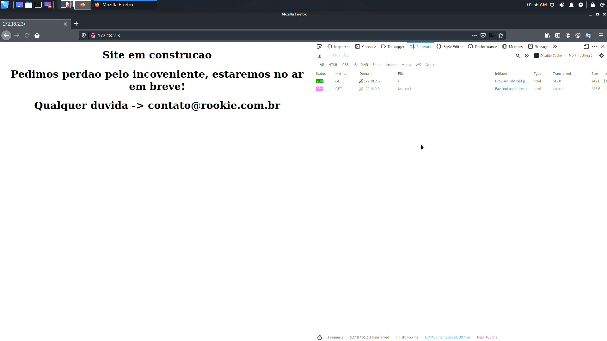

O mesmo com o Source:
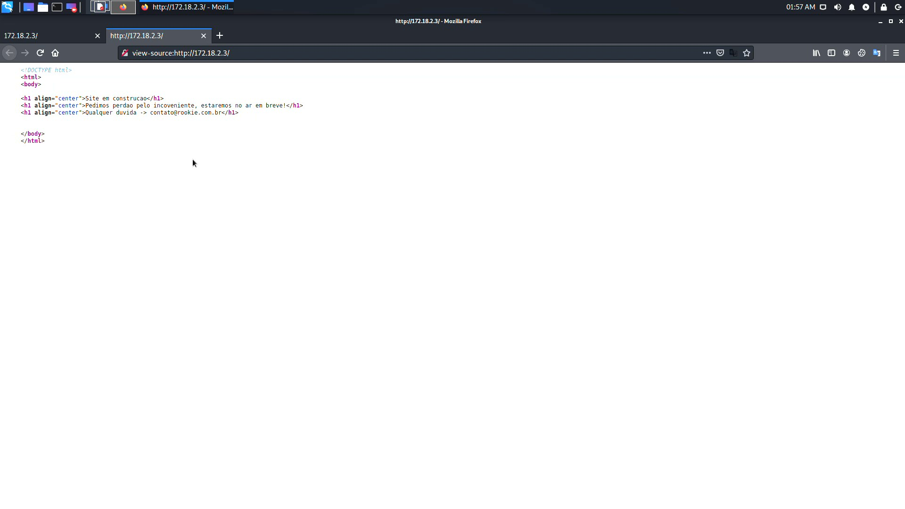

Como o site era simples de mais, sem nenhuma informação útil, decido dar uma olhada na porta 21 que no caso esta rodando um protocolo FTP.

Porem isso não é tudo, como podemos ver no scan que fiz do NMAP ele nos diz que há um usuário (anonymous) 
[Mais informações sobre usuários Anonymous](http://penta2.ufrgs.br/Roseclea/anonymous.html)
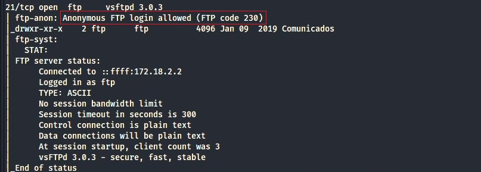

Apos nos conectarmos com o usuário anonymous encontramos um arquivo oculto contendo nossa primeira FLAG e informações muito interessantes:
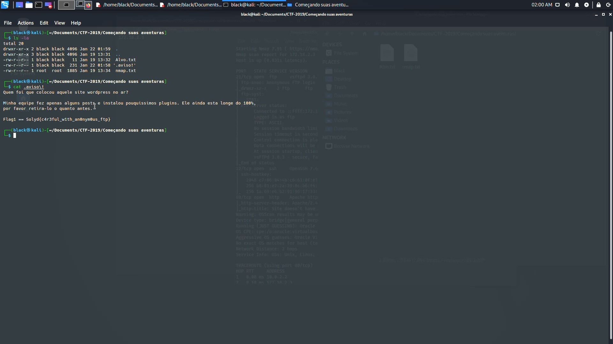

Após um simples Brute force de diretórios em nosso alvo encontramos o site wordpress que aviam mencionado:
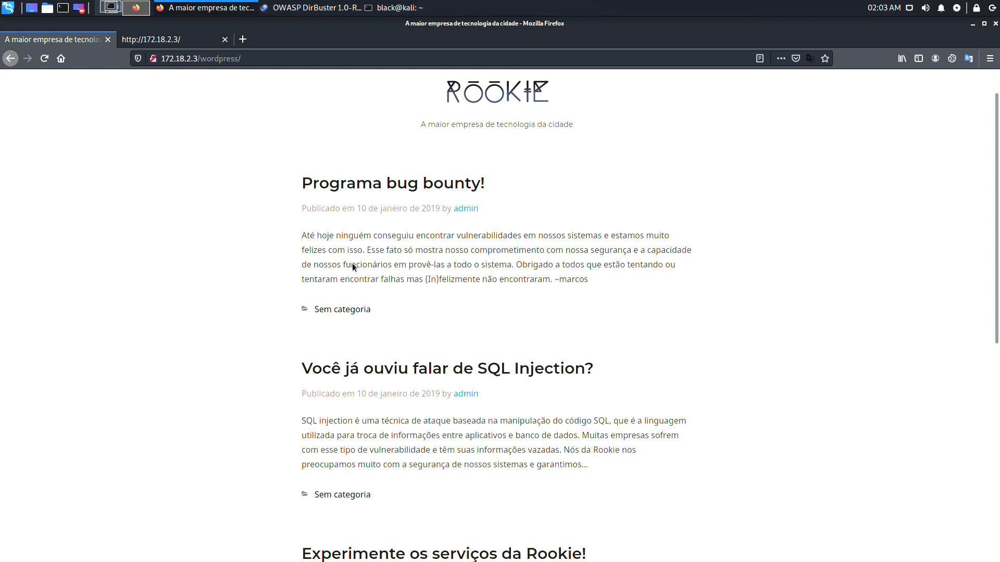

__Infelizmente tive vários problemas com a gravação deste desafio a imagem a seguir se trata de um scan que fiz com o Wpscan__ [Mais informações sobre Wpscan](https://wpscan.com/wordpress-security-scanner).
 Com nosso scan pronto encontramos um plugin com varias vulnerabilidades já descobertas:

Com uma breve pesquisa descobrimos que o mesmo plugin contem uma vulnerabilidade de SQL injection:
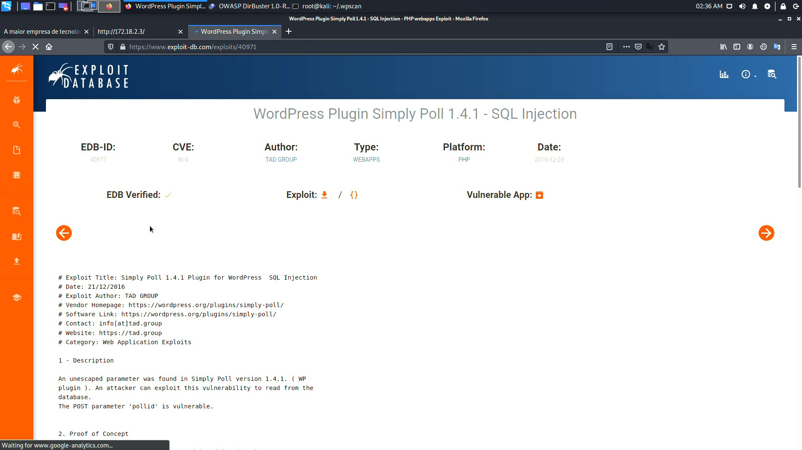

#Exploração

Após uma longa faze de captura de informações passamos a explorar o Exploit, onde conseguimos fazer o dump do banco de dados, junto com nossa segunda FLAG:
[Mais informações sobre SQLmap](http://sqlmap.org/)
__NOTA: A gravação da exploração também foi corrompida, a exploração completa do SQLI levou quase 4 horas, por isso há apenas algumas partes no video!__
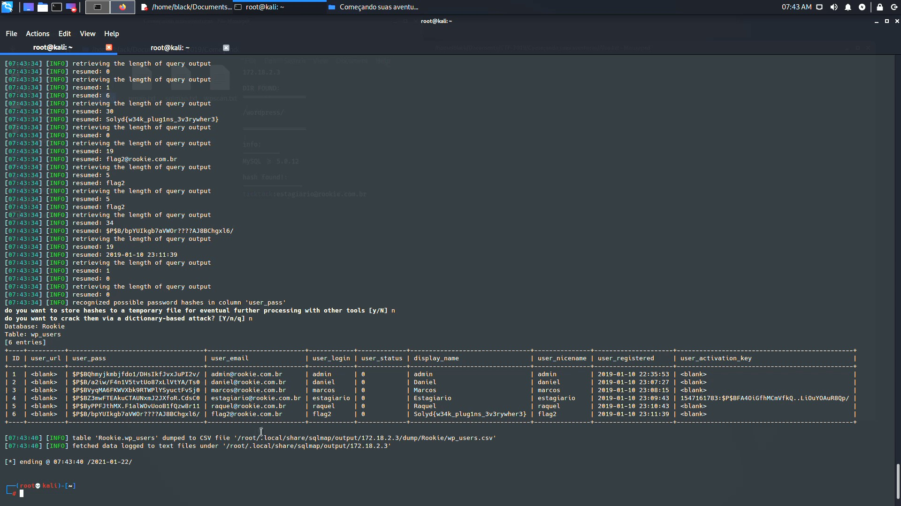

Apos o crack da senha do estagiário conseguimos um login no site, e por sorte nosso estagiário dissídio que seria uma boa deixar a mesma senha em seu SSH, por tanto ao quebrar a hash tínhamos um login no site com permissão ADMIN e um login no SSH:

Após uma breve exploração no servidor achamos varias informações e nossa terceira FLAG, faltando apenas uma:
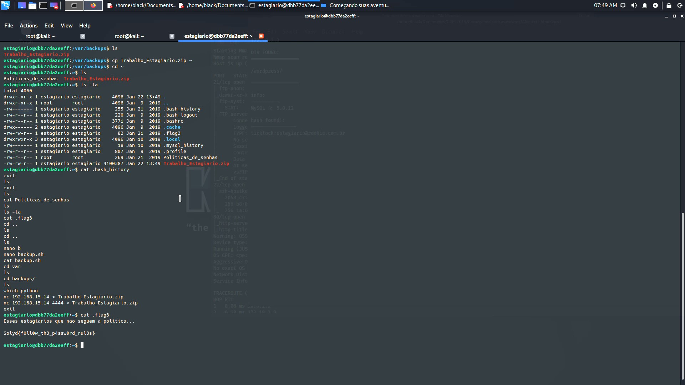

Mais um pouco de exploração e encontramos os arquivos de usuários e senhas(passwd/shadow),
que nos permitira fazer um Brut force na senha do usuário ROOT, porem é algo que complica muito pois dificilmente um usuário ROOT teria uma senha fraca:
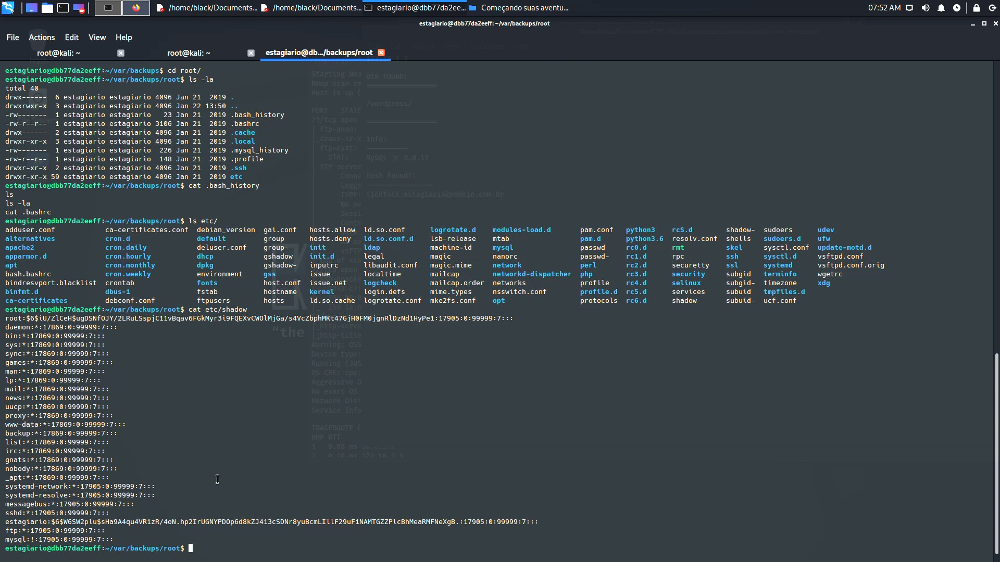

Graças a uma chave RSA copiada junta com o backup conseguimos nossa tão aguardada escalação de privilégio :):
[Mais sobre chave RSA](https://cloud.ibm.com/docs/ssh-keys?topic=ssh-keys-generating-and-using-ssh-keys-for-remote-host-authentication&locale=pt-BR)
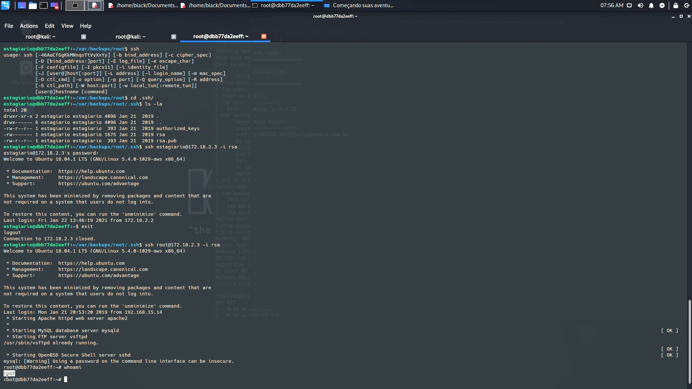

Ai ficou fácil pegar nossa última FLAG:
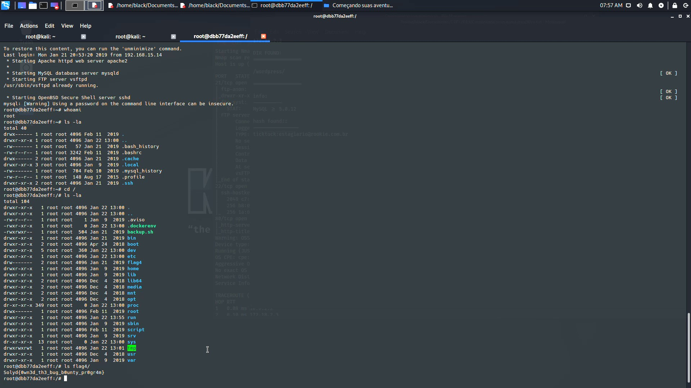

#Espero que tenham gostado e aprendido com nosso primeiro desafio :)